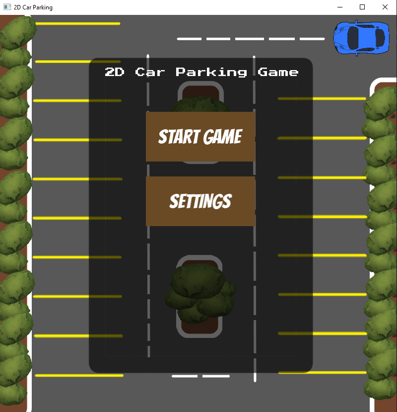
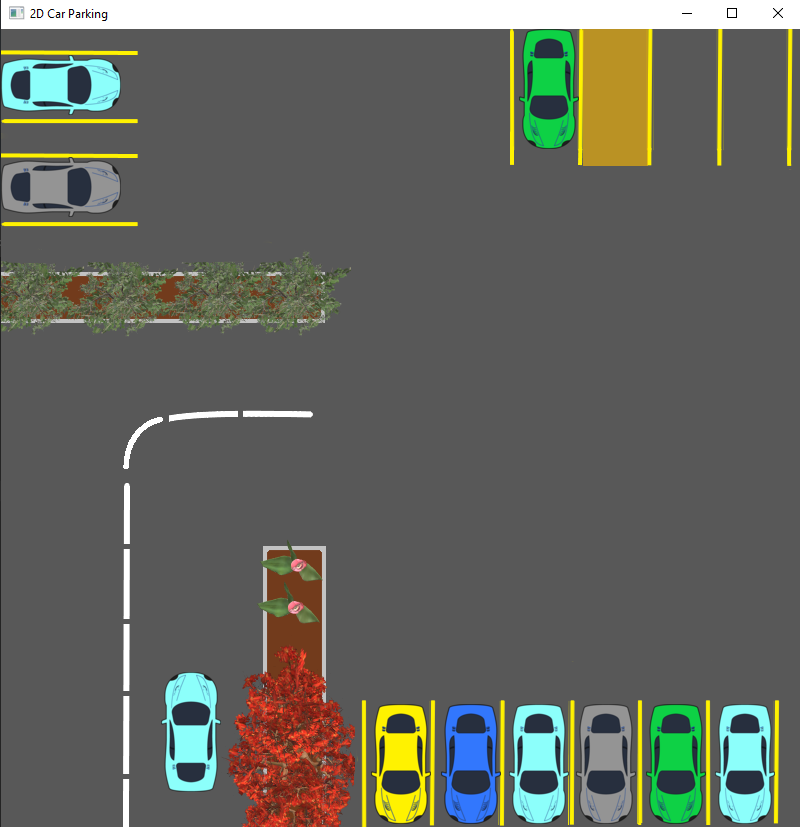

# 2D-Car-Parking-Game
A game created in C++ using SFML where you have to park a car in a specific parking slot.

If you have any issues you may create a New Issue in Issues tab.

Known bugs:
- Player vehicle sometimes does not render

